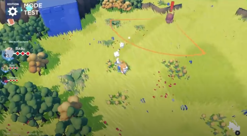

# Art direction

Target look: a bright, sunny low-poly meadow seen from above. Warm yellow-green
ground, dark round-canopy trees, soft see-through shadows, and lots of small
things scattered on the grass (flowers, pebbles, bushes) so the ground never
reads as empty.

## Palette

Defined in `src/game/render/palette.ts`. Every lit surface picks from it.

| Name       | Hex       | Use                                         |
|------------|-----------|---------------------------------------------|
| `meadow`   | `#9dbf58` | Ground and grass, most of the screen        |
| `meadowPatch` | `#a7c263` | Large soft lighter patches on the ground |
| `leaf`     | `#52834a` | Foliage                                     |
| `leafDeep` | `#34574a` | Foliage in shade                            |
| `autumn`   | `#d4945a` | Autumn trees, fire, elite enemies           |
| `wheat`    | `#dcc89e` | Pale stone, light wood, dust                |
| `rock`     | `#8f735c` | Cliff faces                                 |
| `bark`     | `#6b4f3f` | Dark wood, cliff shadow, leather, boss      |
| `stone`    | `#8f8c99` | Rock, walls, bonfire stones                 |
| `sea`      | `#245a73` | Deep water                                  |
| `berry`    | `#c65364` | Flowers, small enemies                      |
| `gold`     | `#e8c068` | Treasure, brass, glows, pickups             |
| `cream`    | `#fff4dc` | Highlights, metal, statues                  |

Lights (`LIGHT`): sky `#bcdde8`, bounce `#7d8a5e`, sun `#fff1d0`.

## Rules

1. **One dominant family.** Greens around a warm yellow-green cover most of the
   screen. Warm earth tones (rock, bark, wheat, autumn) are the secondary
   family. Roughly 60 % greens, 30 % earth, 10 % accents.
2. **Accents come from the other side of the wheel.** `berry` sits near the
   complement of `meadow`, so a few red dots pop on the grass without
   needing to be big. Keep accents small: an accent everywhere is no accent.
3. **Shade leans cool, light leans warm.** The sun is warm cream, the sky light
   is cool blue, so the lit side of a shape is yellower and the shaded side
   bluer. Dark palette entries (`leafDeep`, `stone`) are pushed toward blue or
   violet for the same reason. No neutral greys.
4. **Gameplay must read.** Enemies use warm accents (`berry`, `autumn`, `bark`)
   so they stand out against both the green ground and the grey-violet stone.
   Nothing that matters to the player shares a colour with the ground.
5. **Big areas stay muted.** Meadow, rock and sky are the least saturated
   entries; only small accents are allowed to be loud. A fully saturated
   ground tires the eye and leaves accents nothing to stand out against.
6. **Value before hue.** Trees darker than the ground, statues lighter than
   it. If a screenshot turned to greyscale still separates ground, trees and
   characters, the colours work.

## Lighting

In `src/game/world/Environment.ts`.

- Sun-dominated: warm sun at 2.8 against a hemisphere at 0.85. The contrast
  between them is what gives low-poly shapes their form.
- Shadows at 0.75 intensity: the colour under a shadow still shows through, so
  shade on grass stays green instead of turning grey.
- Soft shadow edges (`shadow.radius` 4, PCF).
- Fog fades to the sky colour.

## Ground

- Ground and blades share `grassColorAt(xz)` (`world/grass/groundPalette.ts`):
  the base meadow, with large soft `meadowPatch` blobs about 14 units across.
  Blades use their root position, so they always match the ground under them.
- Cliff walls are smooth-shaded (welded vertices, averaged normals) so the
  rock reads as a rounded mass, while the grass tops keep flat normals.

## Not done yet

- Round-canopy trees (merged spheres with normals pointing out from the
  canopy centre, so the whole crown shades like one soft ball).
- Ground scatter: flowers, pebbles, small bushes.
- More top-down camera, closer to the reference.
